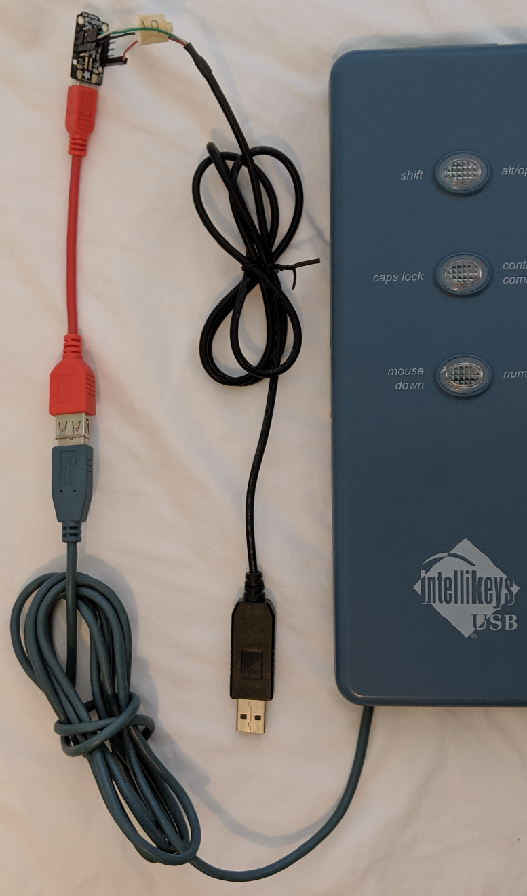

# IntelliKeys_uhls
IntelliKeys USB host driver for the USB Host Library for SAMD.

The only example that should work is ikevent.ino.

The firmware directory has a UF2 file for drag and drop upload. No need to
setup the IDE, board packages, libraries, etc. The output is on UART TX at
115200, 8N1.

The repo will include test.sh which is a bash script to create a clean room
environment to build the driver. It installs a fresh copy of the IDE, board
packages, and libraries then builds the sample code. This is kind of like a
continuous integration script to make sure I have not forgotten to mention
any required libraries or IDE settings. It also is helpful for setting up
the IDE for real development.

The red cable is a USB OTG to host cable. The tiny board is a Trinket M0. The
cable connected to the Trinket M0 is a USB TTL serial cable similar to this
https://www.adafruit.com/product/954.

Even though the cable is described for use with Raspberry Pi it works with any
TTL UART with 3.3V logic levels. Work fine with ARM and ESP boards. The cable
plugs into a computer running a terminal program displaying whatever comes
out of the Trinket M0 UART TX.

